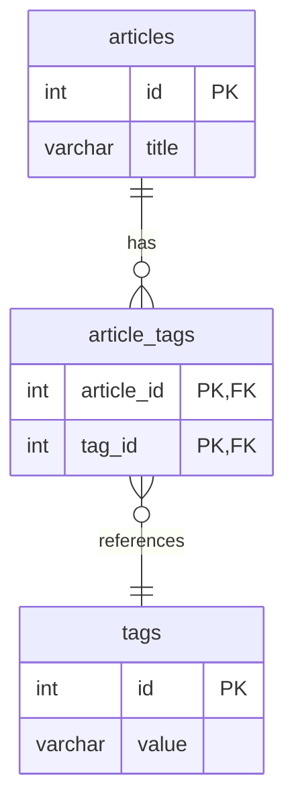
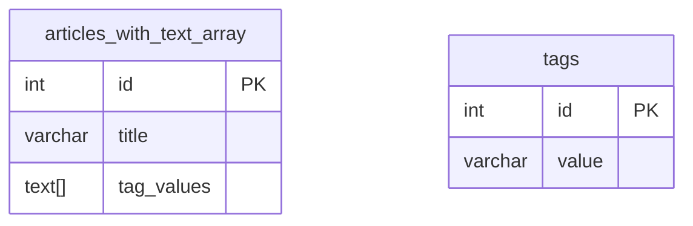
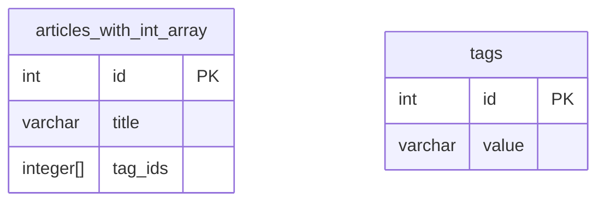

## 태그 검색시스템 디비 설계 테스트

tech blog hub의 tag 기반 검색시스템 데이터베이스 스키마 구조 설계를 위한 테스트 레포

## 테스트 데이터베이스 구조

### 1. article : tag = n : m relational table을 이용

[schema.sql 바로가기](./schemas/relational-table/init/01-schema.sql)

### 2. TEXT[] column을 이용한 tag 저장

[schema.sql 바로가기](./schemas/tag-array-text/init/01-schema.sql)

### 3. Integer[] column을 이용한 tag 저장

[schema.sql 바로가기](./schemas/tag-array-integer/init/01-schema.sql)
