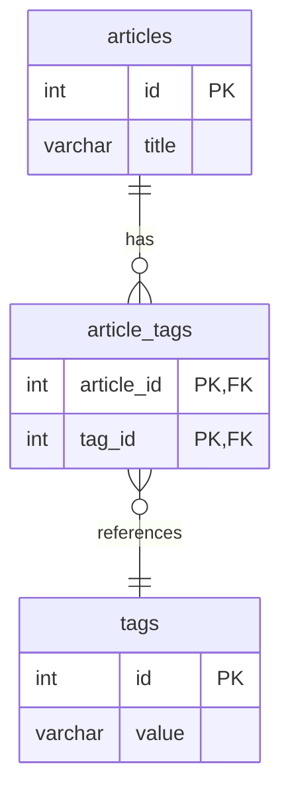
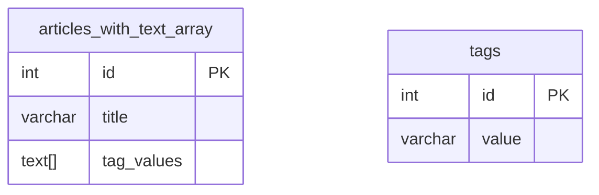
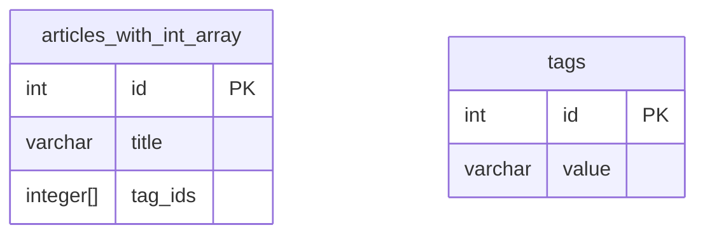

## 태그 검색시스템 디비 설계 테스트

tech blog hub의 tag 기반 검색시스템 데이터베이스 스키마 구조 설계를 위한 테스트 레포

## 테스트 데이터베이스 구조

### 1. article : tag = n : m relational table을 이용

[schema.sql 바로가기](./schemas/relational-table/init/01-schema.sql)

### 2. TEXT[] column을 이용한 tag 저장

[schema.sql 바로가기](./schemas/tag-array-text/init/01-schema.sql)

### 3. Integer[] column을 이용한 tag 저장

[schema.sql 바로가기](./schemas/tag-array-integer/init/01-schema.sql)

# 테스트 결과 예제

## 테스트 조건

- articles : 100,000 rows
- tags : 100 rows

- 각각의 article은 총 3-4개의 tag를 가지고있음

## 분석 데이터

[실행 결과 output 파일 보러가기](./example-output.txt)

### 1. Average Execution Time Comparison (ms)

| Query Condition | Relational Table | TEXT[] Array | INTEGER[] Array |
|----------------|------------------|--------------|-----------------|
| Single Tag | 18.0248 | 5.4736 | 4.3738 |
| Multiple Tags AND | 21.0704 | 0.1189 | 1.0732 |
| Multiple Tags OR | 24.8203 | 8.5783 | 7.7617 |

### 2. Detailed Results for Each Implementation

#### Relational Table - Single Tag Search
| Metric | Value |
|--------|--------|
| Average Execution Time | 18.0248ms |
| Average Planning Time | 738.499µs |
| Min Execution Time | 13.584ms |
| Max Execution Time | 21.436ms |

#### Relational Table - Multiple Tags AND
| Metric | Value |
|--------|--------|
| Average Execution Time | 21.0704ms |
| Average Planning Time | 1.1211ms |
| Min Execution Time | 19.662ms |
| Max Execution Time | 22.761ms |

#### Relational Table - Multiple Tags OR
| Metric | Value |
|--------|--------|
| Average Execution Time | 24.8203ms |
| Average Planning Time | 774.1µs |
| Min Execution Time | 21.153ms |
| Max Execution Time | 27.517ms |

#### TEXT[] Array - Single Tag Search
| Metric | Value |
|--------|--------|
| Average Execution Time | 5.4736ms |
| Average Planning Time | 183.5µs |
| Min Execution Time | 3.847ms |
| Max Execution Time | 7.372ms |

#### TEXT[] Array - Multiple Tags AND
| Metric | Value |
|--------|--------|
| Average Execution Time | 0.1189ms |
| Average Planning Time | 201µs |
| Min Execution Time | 64µs |
| Max Execution Time | 243µs |

#### TEXT[] Array - Multiple Tags OR
| Metric | Value |
|--------|--------|
| Average Execution Time | 8.5783ms |
| Average Planning Time | 150.3µs |
| Min Execution Time | 6.557ms |
| Max Execution Time | 9.677ms |

#### INTEGER[] Array - Single Tag Search
| Metric | Value |
|--------|--------|
| Average Execution Time | 4.3738ms |
| Average Planning Time | 158.8µs |
| Min Execution Time | 2.72ms |
| Max Execution Time | 6.607ms |

#### INTEGER[] Array - Multiple Tags AND
| Metric | Value |
|--------|--------|
| Average Execution Time | 1.0732ms |
| Average Planning Time | 209.2µs |
| Min Execution Time | 695µs |
| Max Execution Time | 1.407ms |

#### INTEGER[] Array - Multiple Tags OR
| Metric | Value |
|--------|--------|
| Average Execution Time | 7.7617ms |
| Average Planning Time | 218.4µs |
| Min Execution Time | 5.531ms |
| Max Execution Time | 9.983ms |

## 각각 테스트 실행 결과 정리

### Relational Table Implementation

#### Single Tag Search
| Run | Execution Time | Planning Time | Total Time |
|-----|---------------|---------------|------------|
| 1 | 19.684ms | 831µs | 21.995583ms |
| 2 | 19.230ms | 769µs | 21.699584ms |
| 3 | 17.466ms | 1002.999µs | 19.866917ms |
| 4 | 16.280ms | 901µs | 18.540792ms |
| 5 | 16.998ms | 523µs | 18.721291ms |
| 6 | 21.436ms | 886µs | 23.951417ms |
| 7 | 16.250ms | 533µs | 18.272625ms |
| 8 | 21.400ms | 786µs | 23.694083ms |
| 9 | 13.584ms | 509µs | 15.626375ms |
| 10 | 17.920ms | 644µs | 19.964208ms |

#### Multiple Tags AND
| Run | Execution Time | Planning Time | Total Time |
|-----|---------------|---------------|------------|
| 1 | 22.761ms | 1.220ms | 27.870334ms |
| 2 | 20.068ms | 808µs | 22.516792ms |
| 3 | 20.540ms | 780µs | 22.855542ms |
| 4 | 21.288ms | 1.371ms | 24.052708ms |
| 5 | 21.949ms | 750µs | 24.322291ms |
| 6 | 21.347ms | 1.348ms | 24.266417ms |
| 7 | 21.822ms | 1.523ms | 25.026250ms |
| 8 | 19.662ms | 1.012ms | 22.030416ms |
| 9 | 19.966ms | 1.004ms | 22.280333ms |
| 10 | 21.301ms | 1.395ms | 24.324375ms |

#### Multiple Tags OR
| Run | Execution Time | Planning Time | Total Time |
|-----|---------------|---------------|------------|
| 1 | 27.517ms | 1.077ms | 29.860292ms |
| 2 | 26.171ms | 816µs | 28.206792ms |
| 3 | 24.140ms | 675µs | 25.806417ms |
| 4 | 24.448ms | 1.289ms | 27.043209ms |
| 5 | 25.858ms | 737µs | 27.811250ms |
| 6 | 26.690ms | 456µs | 28.230250ms |
| 7 | 21.870ms | 936µs | 23.997958ms |
| 8 | 21.153ms | 497µs | 22.599791ms |
| 9 | 24.919ms | 627µs | 26.640958ms |
| 10 | 25.437ms | 631µs | 27.248167ms |

### TEXT[] Array Implementation

#### Single Tag Search
| Run | Execution Time | Planning Time | Total Time |
|-----|---------------|---------------|------------|
| 1 | 4.862ms | 182µs | 6.445042ms |
| 2 | 6.095ms | 235µs | 7.783667ms |
| 3 | 4.263ms | 247µs | 6.264084ms |
| 4 | 7.372ms | 165µs | 8.972583ms |
| 5 | 3.847ms | 147µs | 5.197792ms |
| 6 | 5.879ms | 198µs | 7.454458ms |
| 7 | 4.017ms | 130µs | 5.467625ms |
| 8 | 6.372ms | 139µs | 8.234500ms |
| 9 | 5.891ms | 211µs | 7.685625ms |
| 10 | 6.138ms | 181µs | 8.002417ms |

#### Multiple Tags AND
| Run | Execution Time | Planning Time | Total Time |
|-----|---------------|---------------|------------|
| 1 | 243µs | 255µs | 2.099958ms |
| 2 | 111µs | 200µs | 1.533917ms |
| 3 | 114µs | 165µs | 1.583584ms |
| 4 | 64µs | 135µs | 1.578125ms |
| 5 | 114µs | 212µs | 1.824875ms |
| 6 | 91µs | 241µs | 1.668958ms |
| 7 | 130µs | 273µs | 2.136375ms |
| 8 | 107µs | 192µs | 1.654459ms |
| 9 | 97µs | 170µs | 1.624208ms |
| 10 | 118µs | 167µs | 1.559458ms |

#### Multiple Tags OR
| Run | Execution Time | Planning Time | Total Time |
|-----|---------------|---------------|------------|
| 1 | 9.517ms | 151µs | 11.230750ms |
| 2 | 9.433ms | 128µs | 10.883083ms |
| 3 | 7.492ms | 166µs | 9.163959ms |
| 4 | 6.557ms | 193µs | 8.513541ms |
| 5 | 7.052ms | 127µs | 8.373875ms |
| 6 | 9.673ms | 159µs | 14.112125ms |
| 7 | 9.677ms | 164µs | 12.145833ms |
| 8 | 9.375ms | 123µs | 11.318083ms |
| 9 | 8.898ms | 164µs | 10.804541ms |
| 10 | 8.109ms | 128µs | 9.588709ms |

### INTEGER[] Array Implementation

#### Single Tag Search
| Run | Execution Time | Planning Time | Total Time |
|-----|---------------|---------------|------------|
| 1 | 5.130ms | 217µs | 7.047750ms |
| 2 | 4.685ms | 212µs | 6.283000ms |
| 3 | 4.414ms | 177µs | 6.664625ms |
| 4 | 6.607ms | 185µs | 8.707125ms |
| 5 | 4.928ms | 147µs | 6.484709ms |
| 6 | 4.299ms | 119µs | 5.642917ms |
| 7 | 3.194ms | 154µs | 4.364666ms |
| 8 | 3.121ms | 117µs | 4.428458ms |
| 9 | 2.720ms | 103µs | 3.706959ms |
| 10 | 4.640ms | 157µs | 6.257084ms |

#### Multiple Tags AND
| Run | Execution Time | Planning Time | Total Time |
|-----|---------------|---------------|------------|
| 1 | 695µs | 139µs | 2.290208ms |
| 2 | 1.199ms | 187µs | 2.655333ms |
| 3 | 718µs | 205µs | 2.144333ms |
| 4 | 922µs | 167µs | 3.252333ms |
| 5 | 918µs | 217µs | 2.510041ms |
| 6 | 1.312ms | 225µs | 3.585250ms |
| 7 | 1.407ms | 273µs | 3.440292ms |
| 8 | 1.268ms | 171µs | 2.657500ms |
| 9 | 976µs | 247µs | 2.656250ms |
| 10 | 1.317ms | 261µs | 3.211708ms |

#### Multiple Tags OR
| Run | Execution Time | Planning Time | Total Time |
|-----|---------------|---------------|------------|
| 1 | 6.988ms | 197µs | 8.605542ms |
| 2 | 6.446ms | 318µs | 8.359459ms |
| 3 | 5.531ms | 173µs | 8.023583ms |
| 4 | 9.288ms | 211µs | 11.085541ms |
| 5 | 7.661ms | 298µs | 10.007959ms |
| 6 | 7.133ms | 158µs | 8.897125ms |
| 7 | 8.625ms | 234µs | 10.589916ms |
| 8 | 9.983ms | 245µs | 12.122042ms |
| 9 | 8.173ms | 169µs | 9.872083ms |
| 10 | 7.789ms | 181µs | 9.711417ms |
